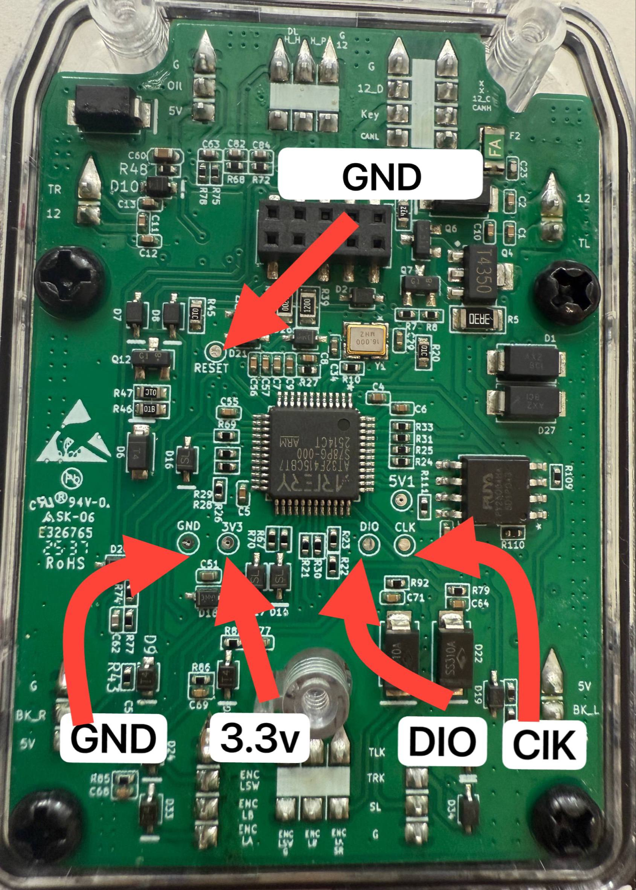
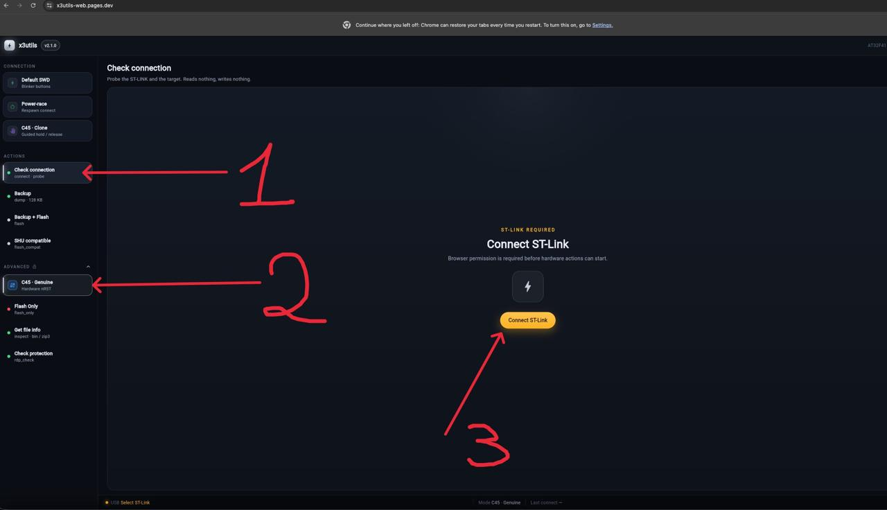

[🇬🇧 English](FAQ.md)  ·  🇷🇺 **Русский**

# Как снять дамп VCU Segway GT3 Pro

Полный дамп Flash VCU — это страховочная копия стоковой прошивки **вашего** контроллера. Его нужно сделать **до** любой записи в чип. Размер дампа: **128 КБ (131072 байта)**.

Утилита: [x3utils](https://github.com/ztakis/x3utils). Она работает с VCU по ST-LINK / SWD.

> **Осторожно.** Плохой контакт, неверные провода или прерванная прошивка могут оставить VCU нерабочим, пока его не восстановят. Сначала всегда снимайте полный дамп и храните файл в надёжном месте. Всё делается на свой риск.

Это руководство только про **чтение** (проверка связи и Backup). Пункты вроде Backup + Flash, Flash Only, SHU compatible и Unlock / Rescue для снятия дампа **не нужны**. **Flash SHU Compatible на GT3 / GT3 Pro не поддерживается** ни на какой версии VCU.

Пошаговое видео (веб-версия x3utils): [https://youtu.be/xceug-i_RRA](https://youtu.be/xceug-i_RRA)

---


## Что понадобится

- Плата VCU GT3 Pro (MCU **AT32F415CBT7**) с доступом к тестовым площадкам SWD
- Программатор **ST-LINK** (оригинал / Nucleo или распространённый клон) и USB-кабель с линиями данных, не «только зарядка»
- Провода на **GND**, **3.3V**, **DIO (SWDIO)**, **CLK (SWCLK)**; для оригинального ST-LINK ещё **RST / NRST** на C45
- Питание платы VCU (от самоката / основного разъёма). Не запитывайте плату сразу и от самоката, и от выхода 3.3V программатора
- Компьютер или Android-телефон: Chrome или Edge. Firefox, Safari и браузеры iPhone / iPad **не работают** с WebUSB

---


## 1. Подключение ST-LINK к плате

Подключите провода **точно по фото**. Слева направо у ряда площадок: **GND**, **3.3v**, **DIO**, **CLK**. Reset — отдельно, на **GND**.




| Площадка на плате               | Сигнал ST-LINK              | Зачем                                                                                                                                       |
| ------------------------------- | --------------------------- | ------------------------------------------------------------------------------------------------------------------------------------------- |
| **GND**                         | `GND`                       | Общая земля. Без неё SWD не заработает                                                                                                      |
| **3.3v**                        | `3.3V` / `VAPP` / `VTarget` | Опорное 3.3V цели. На оригинальном ST-LINK это обычно **измерение** напряжения цели, а не питание платы                                     |
| **DIO**                         | `SWDIO` / `DIO`             | Данные SWD                                                                                                                                  |
| **CLK** (на фото подписано ClK) | `SWCLK` / `CLK`             | Тактовая SWD                                                                                                                                |
| **RST\RESET (C45)**             | `GND`                       | Reset MCU. Нужен для режима **C45 Genuine**. Стрелка на фото указывает на переходное отверстие у конденсатора C45, рядом с надписью `RESET` |


Практические правила:

- Провода короткие и не отваливаются в процессе.
- Не путайте **DIO** и **CLK**.
- Питайте VCU **одним** способом: либо основной разъём / самокат, либо (отдельно) 3.3V со ST-LINK, если вы сознательно запитываете плату только от программатора. **Не оба сразу.**
- Режим **C45 Genuine**: `GND` программатора постоянно сидит на **RST\RESET (C45)**.
- Режим **C45 Clone**: линию `NRST` обычно **не** используют (у клонов reset часто мёртвый). Когда утилита попросит, замкните **C45 на GND**, затем отпустите.

---


## 2. Снятие дампа через x3utils

Выберите один способ. Веб в Chrome — самый короткий путь, если браузер видит ST-LINK.

Официальные гайды x3utils:

- Windows: [x3utils_win/README.md](https://github.com/ztakis/x3utils/blob/main/x3utils_win/README.md)
- macOS: [x3utils_mac/README.md](https://github.com/ztakis/x3utils/blob/main/x3utils_mac/README.md)
- Linux: [x3utils_linux/README.md](https://github.com/ztakis/x3utils/blob/main/x3utils_linux/README.md)
- Релизы GUI / CLI / APK: [github.com/ztakis/x3utils/releases](https://github.com/ztakis/x3utils/releases)
- Wiki: [github.com/ztakis/x3utils/wiki](https://github.com/ztakis/x3utils/wiki)


### Chrome / Edge на компьютере

1. Откройте [https://x3utils-web.pages.dev/](https://x3utils-web.pages.dev/) в **Chrome** или **Edge**.
2. Дальше нажимайте в том порядке, который на скриншоте (номера 1 → 2 → 3):




| Шаг   | Куда нажать                                  |
| ----- | -------------------------------------------- |
| **1** | **Check connection** в блоке Actions         |
| **2** | **C45 - Genuine** (Hardware nRST) в Advanced |
| **3** | **Connect ST-Link**                          |


1. Если проверка связи прошла, в Actions выберите **Backup** (dump ~128 KB) и сохраните файл.
2. Не закрывайте вкладку и не трогайте провода, пока дамп не закончится.

Подписи в интерфейсе могут чуть отличаться в новых версиях сайта; смысл тот же: сначала probe, режим C45, подключение ST-LINK, затем Backup. Подробный разбор кликов — в [видео](https://youtu.be/xceug-i_RRA).

### Android (Chrome)

На телефоне тот же WebUSB, тоже только Chrome:

- [https://x3utils-web.pages.dev/](https://x3utils-web.pages.dev/)
- мобильная вёрстка: [https://x3utils-web.pages.dev/m/](https://x3utils-web.pages.dev/m/)

Порядок тот же: **Check connection** → **C45 Genuine** (или **C45 Clone**) → **Connect ST-Link** → **Backup**.

Отдельно можно поставить APK из [релизов x3utils](https://github.com/ztakis/x3utils/releases) (arm64). Safari / Firefox / iPhone для WebUSB не подойдут.

### Windows

Два варианта: GUI из релизов или CLI.

**CLI** ([гайд](https://github.com/ztakis/x3utils/blob/main/x3utils_win/README.md)):

1. Скачайте и распакуйте x3utils, откройте папку `x3utils_win`.
2. Запустите `launcher.bat`.
3. Выберите режим: **C** — C45 / Genuine ST-LINK, **B** — C45 / Clone ST-LINK.
4. Пункт **1. Check Connection**.
5. Пункт **2. Backup Full Memory (128 KB)**.
6. Сохраните получившийся `.bin`.

Пока Windows не видит ST-LINK в Диспетчере устройств (без жёлтой иконки), скрипты не помогут: другой кабель, другой порт, драйвер ST-LINK.

**GUI:** скачайте свежий desktop-билд с [страницы релизов](https://github.com/ztakis/x3utils/releases) и сделайте те же действия: режим C45 → проверка связи → Backup.

### macOS

Это не `.dmg` и не приложение в Applications. Нужны Homebrew и Terminal. Полный гайд: [x3utils_mac/README.md](https://github.com/ztakis/x3utils/blob/main/x3utils_mac/README.md).

```bash
cd x3utils_mac
chmod +x installer.sh
./installer.sh
./launcher.sh
```

В лаунчере: режим **C** (Genuine) или **B** (Clone) → **1** Check Connection → **2** Backup Full Memory (128 KB).

Либо GUI из релизов x3utils.

### Linux

Полный гайд: [x3utils_linux/README.md](https://github.com/ztakis/x3utils/blob/main/x3utils_linux/README.md).

```bash
cd x3utils_linux
chmod +x *.sh oocd/bin/openocd
./launcher.sh
```

Дальше те же пункты лаунчера: режим C45 → Check Connection → Backup 128 KB. Если OpenOCD не видит ST-LINK от обычного пользователя, поставьте udev-правила из гайда x3utils и переподключите адаптер.

Либо GUI / AppImage из релизов.

---


## 3. Как понять, что дамп хороший

- Файл существует и весит **ровно 131072 байта**.
- Это не сплошные `0xFF` и не один и тот же байт на весь файл.
- Проверка связи (Check connection) до дампа уже проходила успешно.
- Копию уберите с рабочего стола загрузок: это снимок **вашего** контроллера, по нему можно вернуться на сток.

Если дамп не снимается, **не** переходите к прошивке и **не** запускайте Unlock / Rescue «на всякий случай»: rescue переписывает защиту и может стереть основную Flash.

---


## Если не подключается

1. Ещё раз сверьте **GND / 3.3v / DIO / CLK** с фото. Для Genuine проверьте провод на **C45**.
2. Убедитесь, что плата питается и выбран **один** источник питания.
3. Клон → режим **C45 Clone** (держать C45 на GND по подсказке). Оригинал с `NRST` → **C45 Genuine**.
4. Компьютер должен видеть ST-LINK по USB.
5. В Clone-режиме увеличьте таймер обратного отсчёта, если не успеваете замкнуть C45.
6. Провода не должны шевелиться во время probe и dump.

Подробный разбор ошибок OpenOCD и USB: [Troubleshooting x3utils](https://github.com/ztakis/x3utils/wiki/31.-Troubleshooting).