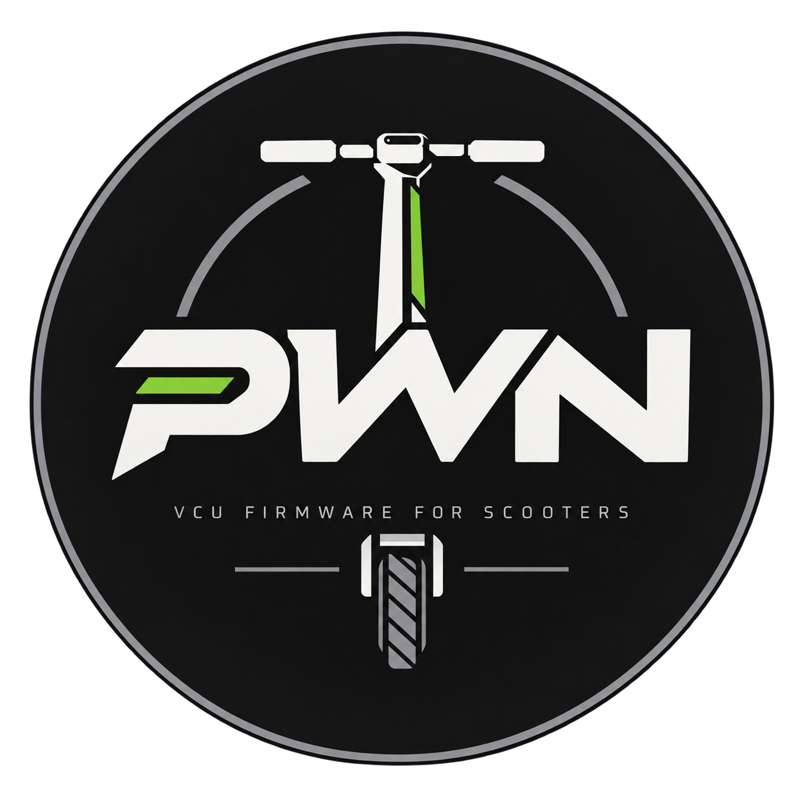

  

  <a href="README.md">🇬🇧 English</a>
  &nbsp;·&nbsp;
  🇷🇺 <strong>Русский</strong>

# Прошивка PWN для Segway GT3 Pro
PWN — это кастомная прошивка **VCU** (модуль управления самокатом) для Segway **GT3 Pro**. Это полноценная прошивка, написанная с нуля, а не очередной патч стока **и НЕ модификация, сделанная с помощью ИИ**. Она заменяет штатное приложение VCU на контроллере и остаётся совместимой с оригинальным TFT-дисплеем, модулем BLE, контроллерами моторов и батареей.

Прошивка рассчитана на VCU GT3 Pro. Она общается с другими модулями самоката на родном языке протокола Segway, поэтому остальная часть самоката продолжает работать как обычный GT3 Pro.

## Какие функции доступны помимо основных

Этих настроек нет в стоковой прошивке. Они задаются в приложении **PowerNine** по BLE и сохраняются на VCU.

- Аварийный режим (police mod): включение по умолчанию и потолок скорости 3–50 км/ч
- Бесконечный буст
- Лимит тока мотора (Iq) отдельно для Eco / Sport / Race: Stock или 1–200 А
- Лимит тока батареи отдельно для Eco / Sport / Race: Stock или 1–150 А
- Громкость бипера 0–100 %
- Смена ориентации переключателей: light+ / light− и mode+ / mode−
- Назначаемые действия для клавиш при удержании: левый и правый поворотник, light− / light+, mode− / mode+, левый тормоз + BOOST, правый тормоз + CRUISE
- Доступные варианты: аварийка, стробоскоп дальним светом, включить / выключить / переключить emergency, переключить габарит
- Настройка частоты стробоскопа 1–25 Гц

Stock означает штатный лимит режима, а не нулевой ток. Токовые значения - максимальный порог устанавливаемый контроллеру, а не фактически заданный ток.

Официальное приложение Segway-Mobility по-прежнему можно использовать для повседневного сопряжения и штатных функций.

## Сначала снимите дамп стоковой VCU

До любой записи в чип сделайте полный бэкап VCU на 128 КБ через ST-LINK. Распиновка, шаги x3utils (Chrome, Android, Windows, macOS, Linux) и признаки хорошего дампа: **[FAQ.ru.md](FAQ.ru.md)**.

## Сообщения об ошибках и запросы функций

Если найден баг или вы хотите предложить некуую новую функциональность, создайте issue: [github.com/PWN-Firmware/GT3-Pro/issues](https://github.com/PWN-Firmware/GT3-Pro/issues)

## Отказ от ответственности

Кастомная прошивка может повредить самокат, аннулировать гарантию и используется **на свой риск**.
